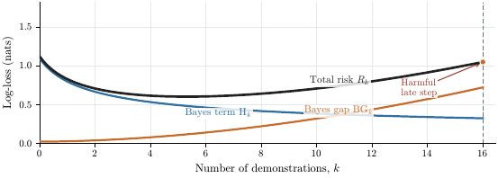
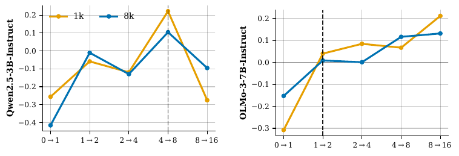

# When Additional Demonstrations Hurt: Bayes-Gap Accounting for Shot-Budget Reliability

[](https://doi.org/10.5281/zenodo.23168719)

**Junxin Fan** (Fudan University) — sole author

> **Status:** Manuscript under review at *Machine Learning* (Springer), 2026. Archived at [doi.org/10.5281/zenodo.23168719](https://doi.org/10.5281/zenodo.23168719).
> The paper PDF is in [`paper/`](paper/). This repository provides the full experiment codebase, the run configurations behind every reported table and figure ([`configs/`](configs/), see the [config manifest](configs/README.md) for the mapping), and the paper figures.

---

## Abstract

Language-model systems increasingly make a deployment-time choice about how much context to present before prediction. Extra demonstrations, retrieved evidence, or memory can add task-relevant information, but they also change the prompt distribution through length, order, formatting, separators, and query position. We study this shot-budget reliability problem under log-loss, using nested-shot in-context learning as a controlled case study. The main result is an exact adjacent-step accounting law: the deployed risk change equals negative Bayes gain plus Bayes-gap growth. A harmful log-loss step therefore occurs precisely when excess-risk growth induced by the new prompt exceeds the Bayes information gain supplied by the added context. A second decomposition separates representation deficiency from readout mismatch. The empirical sections turn this accounting law into a practical audit design for black-box LLMs. On ARC-Challenge candidate scoring, the audit exposes a late-shot deterioration case with an observable Bayes-gap floor; order ensembling reduces order-induced mismatch; and held-out readouts recover substantial log-loss from frozen representations, indicating that part of the harm lies in the final prediction rule rather than in unavailable task information. A held-out HellaSwag audit further shows that log-loss-aware shot policies can improve over a fixed high-shot default in model-specific regimes.

**Keywords:** in-context learning, large language models, log-loss, Bayes gap, prompt sensitivity, shot-budget reliability

## What the paper claims (and where the evidence lives)

1. **An exact accounting law**: for adjacent shot budgets, deployed risk change = −(Bayes gain) + (Bayes-gap growth). Harmful steps occur exactly when prompt-induced excess-risk growth exceeds the information gain of the added context.
2. **A second decomposition** separating *representation deficiency* from *readout mismatch*.
3. **A black-box audit design** turning the law into practice: on ARC-Challenge it exposes a late-shot deterioration case with an observable Bayes-gap floor; order ensembling reduces order-induced mismatch; held-out readouts recover substantial log-loss from frozen representations — part of the harm lies in the prediction rule, not in missing task information.
4. **A held-out HellaSwag audit** showing log-loss-aware shot policies can beat a fixed high-shot default in model-specific regimes.

| Figure | File |
|---|---|
| Fig. 1 (pipeline + closed loop) | [`figures/Fig1a.pdf`](figures/Fig1a.pdf), [`figures/Fig1b.pdf`](figures/Fig1b.pdf) |
| Fig. 2–3 (risk curves, audit) | [`figures/Fig2.pdf`](figures/Fig2.pdf), [`figures/Fig3.pdf`](figures/Fig3.pdf) |
| Fig. 4 (stepwise ΔNLL) | [`figures/Fig4_deltaNLL_sidebyside.pdf`](figures/Fig4_deltaNLL_sidebyside.pdf) |
| Fig. 5 (held-out readout) | [`figures/Fig5.pdf`](figures/Fig5.pdf) |




## Repository structure

```
paper/      manuscript PDF (version under review)
figures/    paper figures (PDF + PNG)
src/overprompting_exp/   experiment package (CLI entry: overprompting_exp.cli)
configs/    run configurations for the reported experiments (YAML; manifest in configs/README.md)
data/       tiny built-in fixtures for the smoke test
download_dataset.py / download_assets.py   fetch public benchmark data
```

## Quick start (smoke test, no LLM required)

```bash
pip install -e .
python -m overprompting_exp.cli e1 --config configs/run_e1_smoke.yaml
```

The smoke config uses a deterministic dummy model on the built-in fixture (`data/smoke_task.jsonl`) to validate the full pipeline and produce JSON outputs. Real-model runs (Hugging Face / vLLM backends, ManyICLBench / LongICLBench / local JSONL tasks) are configured via `configs/`; benchmark data are fetched with the included download scripts. Optional dependencies: `pip install -e ".[hf,datasets]"` (plus `[vllm]` for the vLLM backend, `[plot]` for figures).

## Citation

```bibtex
@misc{fan2026bayesgap,
  author = {Fan, Junxin},
  title  = {When Additional Demonstrations Hurt: Bayes-Gap Accounting for Shot-Budget Reliability},
  year   = {2026},
  doi    = {10.5281/zenodo.23168719},
  url    = {https://doi.org/10.5281/zenodo.23168719},
  note   = {Manuscript under review at \emph{Machine Learning} (Springer)}
}
```

## License

Code in `src/`, `configs/`, and the download scripts is released under the MIT License (see `LICENSE`). The manuscript PDF and figures are © the author and shared for review and reproduction purposes.
